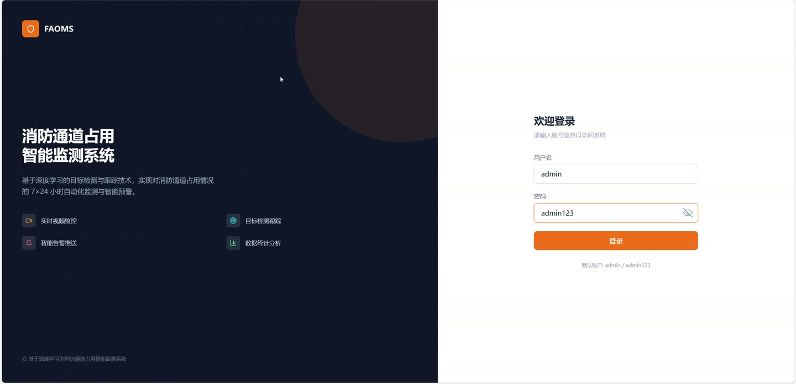
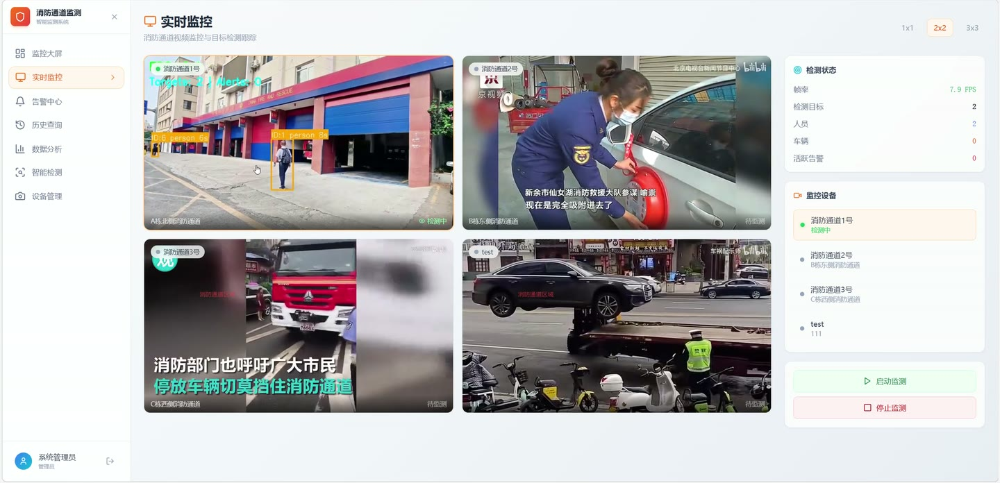
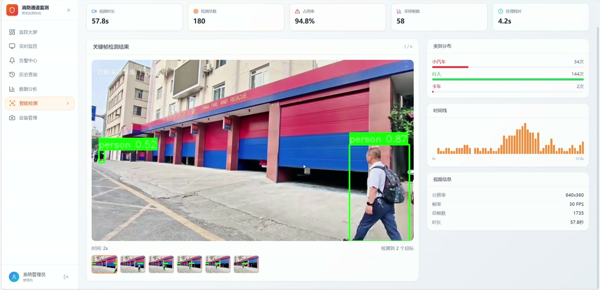
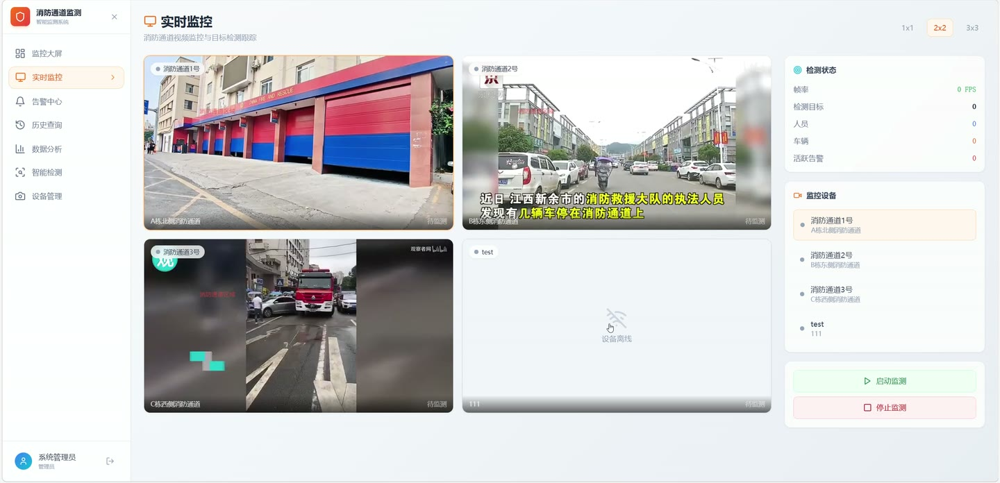
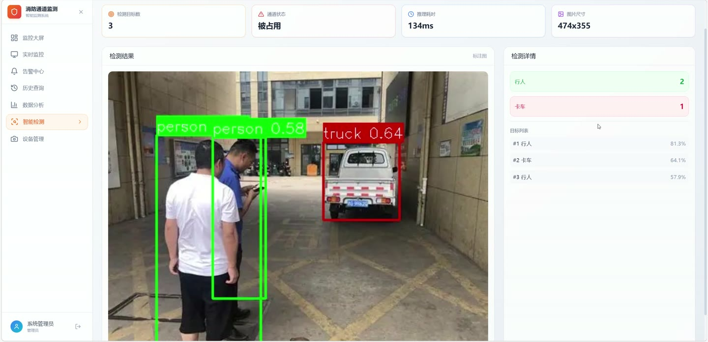
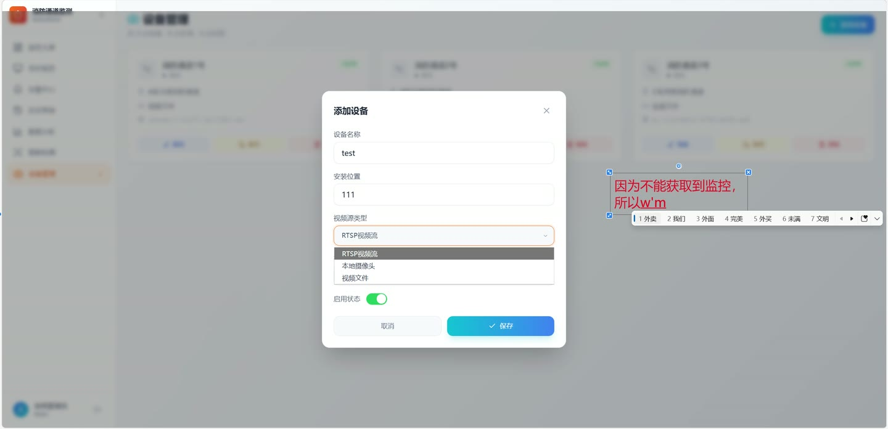

# (附文档)Python+YOLO+深度学习 基于深度学习的消防通道占用智能监测系统

**技术栈**：Python、Flask、PyTorch、YOLO、深度学习、Vue3、MySQL

### 系统简介

本系统是一套基于深度学习（YOLO 目标检测）的消防通道占用智能监测平台，采用前后端分离架构：后端使用 Flask 提供 RESTful API 与 JWT 鉴权，前端使用 Vue3 构建可视化管理界面，AI 推理层基于 PyTorch 与 YOLO 模型完成车辆、人员、障碍物等目标的实时识别。系统区分管理员与操作员两类角色，覆盖监控大屏、实时监测、告警处置、历史查询、数据分析、智能检测与设备管理全流程。
 
### 核心功能
 
### 管理员端

 
- 用户管理：维护系统用户账号，设置用户名、真实姓名、联系电话、邮箱与角色（admin/operator）。 
- 账号启停：通过 is_active 字段启用或禁用账号，控制用户登录权限。 
- 密码安全：基于 werkzeug 的密码哈希存储，支持 set_password/check_password 校验。 
- 登录审计：记录用户最后登录时间 last_login 与创建时间，便于追溯。 
- 设备管理：新增、编辑、删除摄像头设备，维护设备名称、安装位置与视频源配置。 
- 设备启停：通过 is_enabled 开关控制单台设备是否纳入监测。 
- 视频源配置：支持 RTSP 流、本地摄像头（webcam）、视频文件（file）三类视频源类型。 
- 文件上传：支持拖拽上传 MP4/AVI/MOV/MKV 等视频与 JPG/PNG 等图片作为检测源。 
- 监测区域配置：为每台设备保存 ROI 多边形坐标（roi_points JSON），限定占用判定范围。 
- 告警处理：在告警中心对告警执行"处理"或"忽略"，填写处理备注并记录处理人与处理时间。 
- 数据统计：查看总告警数、今日告警、处理率、待处理数、在线设备数及重点点位排名。 
- 数据分析：按近7天/15天/30天查看告警趋势、类型分布、级别分布、24小时时段分布与点位排名。
 
### 操作员端

 
- 账号登录：使用用户名与密码登录，登录成功后获取 JWT Token 并存储于本地。 
- 路由守卫：未登录访问受保护页面时自动跳转登录页，已登录访问登录页自动回首页。 
- 监控大屏：查看今日告警、待处理、已处理、本周/本月告警、在线设备六项关键指标卡片。 
- 告警趋势图：以折线图展示近 7 天每日告警次数变化。 
- 类型分布图：以饼图展示小汽车、摩托车、卡车、自行车、人员、障碍物等占用类型占比。 
- 时段分布图：以柱状图展示 24 小时各时段告警数量分布。 
- 最新告警列表：实时滚动展示最近 5 条告警的级别、类型、点位与时间。 
- 告警中心筛选：支持按告警级别（严重/高危/中危/低危）、处理状态（待处理/处理中/已处理）、占用类型及摄像头名称关键字组合筛选。 
- 告警详情查看：查看告警 ID、级别、占用类型、监控点位、跟踪 ID、持续时长、告警时间与处理状态。 
- 告警截图预览：在详情面板展示告警抓拍图片，无截图时显示占位提示。 
- 告警处置：对待处理告警执行确认处理或忽略，填写处理备注后提交。 
- 分页浏览：告警列表支持分页翻页，实时显示当前筛选结果总数。 
- 智能检测-图片：上传图片执行 AI 检测，返回标注图、检测目标总数、通道状态、推理耗时与图片尺寸。 
- 智能检测-图片详情：按类别统计目标数量，并逐条列出每个目标的类别与置信度。 
- 智能检测-视频：上传视频执行逐帧采样检测，返回视频时长、检测总数、占用率、采样帧数与处理耗时。 
- 关键帧浏览：展示有占用目标的关键帧缩略图，支持点击切换查看对应时间点与目标数。 
- 时间线图：以柱状时间线展示视频各采样时刻的目标数量变化。 
- 视频信息面板：展示分辨率、帧率、总帧数与时长等视频元数据。 
- 历史查询：按条件检索历史告警记录并查看详情。
 
### 技术栈

 后端框架Flask ORMFlask-SQLAlchemy 权限认证Flask-JWT-Extended（JWT Token 鉴权） 实时通信Flask-SocketIO 跨域处理Flask-CORS 深度学习框架PyTorch 目标检测模型YOLOv8（ultralytics） 图像处理OpenCV 前端框架Vue3 前端路由Vue Router（含路由守卫） 图表可视化ECharts（vue-echarts） 图标库lucide-vue-next 数据库MySQL
 
### 交付内容

 
- 后端完整源码 
- 前端完整源码 
- 数据库初始化脚本 
- 万字文档

## 界面展示

---

## 获取完整源码 + 万字文档

本仓库为项目介绍页。**完整前后端源码、数据库初始化脚本、万字项目文档**，请加微信 `kangkangcode`，或访问 [codekk.top](http://codekk.top) 获取。

可作课程设计 / 毕业设计参考，支持远程部署调试。